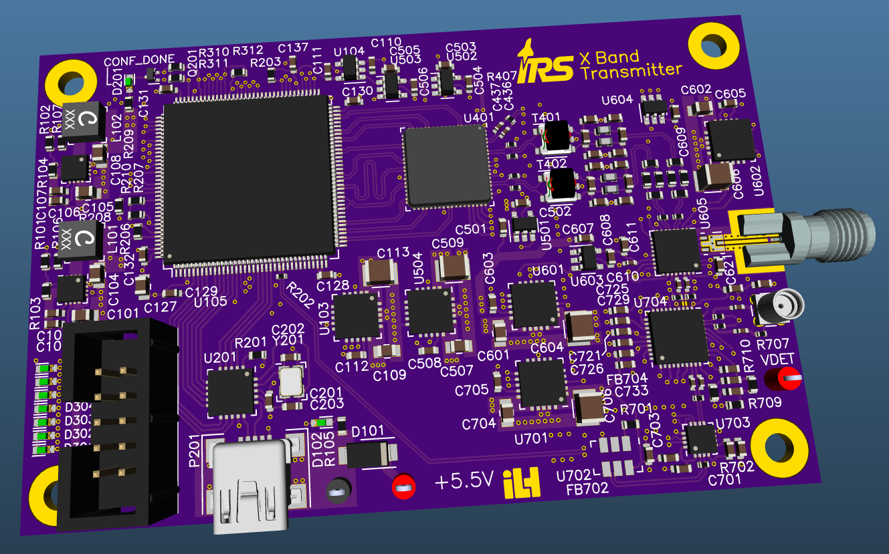

# X Band Transmitter

This project has been my master thesis at the University of Stuttgart at the Institute of Robust Power Semiconductor Systems (ILH) and the Institute of Space Systems (IRS). It's part of larger project of developing a data downlink system (DDS) for an upcoming small satellite.

The transmitter supports a bandwidth of approx 50 MHz at center frequency of nominally 10.475 GHz. Complex baseband data is played back from a 32 KiSa block RAM in the FPGA. For writing data to the block RAM and setting up PLL and DAC, a USB/SPI bridge is included on the board.

I'd like to thank my tutors for allowing me to use my back then largely untested EDA package horizon EDA. Thanks to them I've now got a project to show off what horizon EDA is capable of.

